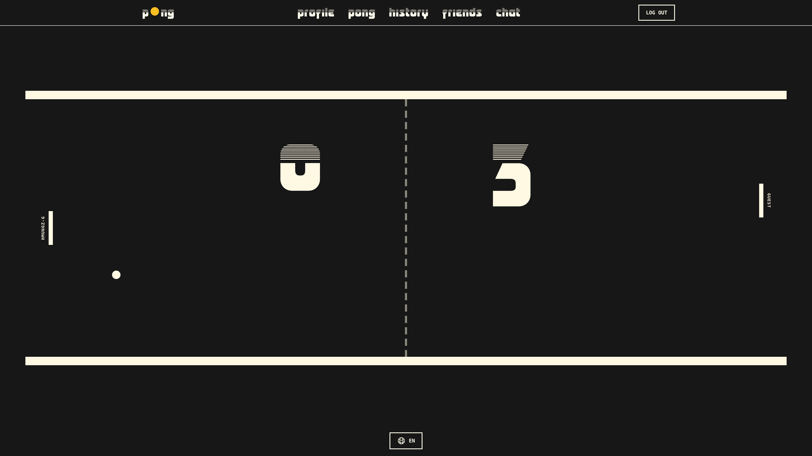

# <h1 align="center">PONG - The Echo From a Distant Past</h1>

<p align="center">
   <b>A modern, extensible Pong game engine built with PixiJS and TypeScript, featuring advanced physics, extended mechanics, real-time multiplayer, and a comprehensive Entity-Component-System architecture.</b><br>
</p>

---

<p align="center">
    
    
    
    
</p>
<p align="center">
    
    
    
    
    
    <a href="https://linktr.ee/hugomgris"></a>
</p>

## Table of Contents

- [Game Overview](#game-overview)
- [Preview](#preview)
- [Quick Start](#quick-start)
- [Game Features](#game-features)
- [Key Technical Features](#key-technical-features)
- [Engine Architecture](#engine-architecture)
- [Postmortem](#postmortem)
- [License](#license)
- [Aknowledgements](#acknowledgments)


---

## Game Overview

This Pong implementation goes far beyond the classic 1972 game, featuring a sophisticated game engine built from the ground up with modern web technologies. The engine implements an Entity-Component-System (ECS) architecture, advanced physics simulation, and supports both local and networked multiplayer gameplay.

## Preview


## Quick Start

### Prerequisites

- **Node.js 18+**
- **Modern Browser** with WebGL support
- **Docker** (for full stack setup)

### Installation

```bash
# Clone the repository
git clone https://github.com/hugomgris/pong.git
cd pong

# Quick setup (recommended)
make

# Access the game at http://localhost:8080
```

## Key Technical Features
- Custom physics engine with precise collision detection
- Extended mechanics built around an array of different balls, moving walls and power-ups/power-downs
- Real-time multiplayer with client-side prediction and server reconciliation
- Modular ECS architecture for extensible gameplay systems
- Advanced visual effects including particle systems and post-processing
- WebGL-accelerated rendering via PixiJS
- Comprehensive audio system with spatial audio effects using Howler
- Multi-language support, with implemented translations in English, Spanish, French and Catalan

## Game Features

### Core Gameplay
- **Classic Pong**: Traditional paddle-and-ball mechanics with modern physics
- **Multiple Ball Types**: Standard, Burst, Spin, and Multiplying balls with unique behaviors
- **AI Opponent**: Bot opponent available for training
- **Power-up System**: Magnetic paddles, speed boosts, size modifications, and stunning bullets
- **Game Variations**: Classic mode, Enhance mode, online matchmaking (1vs1) and tournament system

### Visual & Audio
- **Particle Systems**: Dynamic particle effects for collisions and special events
- **Post-Processing**: Screen-space effects and shaders (CRT toggleable style)
- **Spatial Audio**: 3D positioned sound effects with Howler.js
- **Responsive Graphics**: Scalable rendering for different screen sizes
- **VFX Library**: Trails, explosions, and environmental effects

### Multiplayer Features
- **Real-time Networking**: WebSocket-based multiplayer low latency
- **Lag Compensation**: Client-side prediction with server authority
- **Cross-Platform**: Play across different browsers

## Engine Architecture

### Entity-Component-System

The game implements a pure ECS architecture for maximum flexibility and performance:

```typescript
// Entity: Container for components
class Entity {
    id: string;
    components: Map<string, Component>;
    layer: string;
}

// Component: Pure data containers
class PhysicsComponent extends Component {
    x: number; y: number;
    velocityX: number; velocityY: number;
    width: number; height: number;
}

// System: Logic processors
class PhysicsSystem implements System {
    update(entities: Entity[], delta: FrameData): void {
        // Process all entities with physics components
    }
}
```

**Core Systems:**
- **Physics System**: Collision detection, movement, and physics simulation
- **Render System**: PixiJS rendering and graphics management
- **Input System**: Keyboard, mouse, and touch input handling
- **VFX System**: Particle effects and visual feedback
- **AI System**: Computer opponent logic and decision making
- **UI System**: User interface rendering, tracking and updating
- **World System**: Wall transformation and obstacle spawning managament
- **Post Processing System**: screen-wide, CRT effect rendering with layered filters


## Postmortem

### Project Overview

**Timeline**: ~4 months of development  
**Scope**: Modern Pong recreation with advanced features  
**Team**: Part of a group project done with [Marc Catalán - mcatalan](https://github.com/mcatalan15), [Eva Ferré Mur - eferre-m](https://github.com/eferre-m), and [Nicolas Ponchon - nponchon](https://github.com/mrlouf)  
**Target**: 42 School ft_transcendence final project  
**Goals**: Create a sophisticated game engine demonstrating modern web development and game development skills

From the moment development began, thanks to the well-organized team we formed for ft_transcendence—with each member handling a specific part of the project with minimal overlap of interests—the general drive was to seek out all the opportunities that the original *Pong* offered for thinking up new mechanics, dynamics, and aesthetics. Thus, what became immediately evident was that this classic could be broken down into a few elements to play with: the ball, the paddles, and the walls. The list of objectives practically wrote itself and grew as the final vision of what this version of *Pong* would become took shape: different types of balls by tweaking trajectories, movements, and shapes; animated walls that would transform in real-time and obstacles emerging from the background of the screen; power-ups and power-downs affecting the geometry, controls, and capabilities of the paddles, modifying their speed, hit physics, or even giving them the ability to shoot projectiles. Not everything that sprouted during the project's development documentation made it into the final version, of course—and some of the ideas that were left behind still pain me not to have implemented, like an attempt to make all the depth lines and wall shapes based on waves, manipulating the basic formula of a sinusoidal function—but I believe the result is satisfactorily complete and achieves a reasonably unique recreation of the 1972 original.

The initial difficulty, however, went beyond design itself since, due to the guidelines of the general project that caps 42's Common Core, the most urgent thing was to sit down and learn TypeScript (initially I misunderstood the assignment and thought the game had to be made in JavaScript, so add to that the time I spent learning how to handle that language, although it's true that after JS, learning TS is much simpler, happier, and healthier), as well as building a skill base around web development, a programming branch I hadn't touched until this moment. Nothing serious, but something that imposed a slow, measured, and necessarily well-planned start, because the situation also demanded dedicating time to structure, as much as possible, the way to approach what was clearly going to be the longest and most difficult program I had built up to that point. After researching, I chose to dive into the world of ECS (Entity-Component-System) to build the engine, developing a handful of central elements—Ball, Paddle, Walls, Particles, etc.—that would implement the components needed as the project progressed—Physics, Animations, Interactions, Rendering, Text, etc.—and be managed by the network of systems that keeps everything in perpetual motion. In short: these were 4 months of continuous learning on all fronts, hard and at times exhausting, but extremely enriching.

On the aesthetic side, from the first days it was also burned into my mind that I wanted to experiment with a post-processing layer that would give the entire experience a cathode-ray finish. In other branches of my work, like video and audio editing, filters that overlay an analog patina are very common resources for me, which while could be said that lately they can be seen as a sort of commonplace—blame nostalgia, the aesthetic stagnation of a techno-decadent present that has lost identity by betting everything on a sad ideal of optimization that only returns ideological, cultural, and creative bankruptcies, or that simply *looks good and is eye-catching and expresses a minimum of intention*—I believe there's never a lack of room for experimentation and personalization. The visual aspect, however, I didn't want to remain just a flashy overlay, so I had to find a way to connect eyes and hands, video with game, and after some rumination, the ingredient that would gel everything together emerged: those depth lines that make the playing field grow toward the back of the screen. In their first iterations, the movement of these vectors gave the composition volumetry and infinity, turning the game plane—the world where walls, paddles, and balls live—into something like a constant cut of that space that the lines push toward the screen. Something like the illusion of a tomography, upon which emerged a second order of transformation: the lines could twist, transform, compose themselves into different figures that upon reaching the cutting plane could affect the walls. The rest was taking paper and pencil, testing possible geometries, and programming an entire animation and collision generation system that ended up becoming, at least in my judgment, the signature feature of this reimagined Pong.

The wall figures—let's call them worlds, let's aim high—, always tied to the basic lines that constrain the playing area in its most classic and prototypical version, also opened the way to a floating counterpart, obstacles detached from the upper and lower limits that would inject extra unpredictability into the ball's trajectory. All together, each world made of wall and obstacle, I wanted to compose it with a certain entity of its own, giving them names, suggesting a certain perpetual path along a winding route guided by totems and ideograms. Here the direct inspiration—at least inside my head; whether I achieved it or not I leave to you who are reading this—was the long night of the underground road that gives its name to *Kentucky Route Zero*, a game that occupies an irreplaceable place in the foreground of my brain, always present and resonant. In fact, all the aesthetic effort to appeal to the analog, the cathode, the obsolete and the defeated has its root in this influence. The layers of glows, chromatic aberrations, lenticular distortions, and scan lines, all that aged glow that comes from another time—"*The echo of a distant past*"—follows this trail.

### What Went RIGHT

#### **Entity-Component-System Architecture**
Now that it's time to look back, I believe the choice of the ECS system was correct. It worked very well for development, especially for being an absolutely modular paradigm, easily scalable and allowing movement between different levels of functional abstraction that a game like this has, enabling easy addition of new features while polishing those already implemented. This is, to be clear, one of the most valuable lessons I take from here, a structure I will surely use many more times in the future or, directly, in the present, since most freely available game engines—Unity, Godot, Unreal, etc—encourage this way of weaving code.

```typescript
// Adding new features became trivial
class MagneticComponent extends Component { /* just data */ }
class MagneticSystem implements System { /* just logic */ }
```

#### **PixiJS for Rendering**
During the first days of research, having made the decision to make a 2D game for compositional reasons—time constraints and too many new things to learn didn't give me much room to feel I could make an attractive 3D game—the two possibilities that emerged for handling the graphics application were [p5.js](https://p5js.org/) and [PixiJS](https://pixijs.com/). The first gave me more tools to design an interaction between the game and the front-end—one of those ideas that now belong to paths not taken, which would have made game events affect the general visualization of the web, changing colors, shapes, whatever emerged—and the second a more powerful API to compose everything I could think of based on pure code. Opting for the second seems to have been a success, although I'm left with the thorn of that other version that would have blurred the line separating web and application.

#### **Real-time Multiplayer Architecture**
The online multiplayer design was one of the most complicated tasks of the entire project. Programming sockets, coordinating clients, and trying to maintain synchronization that allows fluid matches is, why say it any other way, a bit hellish. Here the crucial decision was to limit matchmaking to the classic version of the game, as well as implement the tournament system exclusively locally—one computer, two chairs, eight participants. With more time I would have tried to bring the complete game to its online modes, like rock beats scissors, calendar always beats ambition.

#### **TypeScript Throughout**
This, really, was imposed by the project, but I'm glad the order was TypeScript instead of JavaScript. Above I mentioned that by not reading carefully I started programming all this in JS, and when porting what I had up to that point to TS I learned that JS tolerates *too much* without complaining. I write this from the perspective of someone who, as I've said several times in this postmortem, is learning several things at once, thinks everything is going well, and under the hood reality is held together with duct tape and rubber bands. TypeScript is much more demanding when it comes to typing—obvious, I know—structuring and making sure what you write makes sense and will work. In summary: I like you, TypeScript, you're cool.

#### **Modular Visual Effects**
The effects turned out, in short, good. The CRT effect exceeded my expectations, although it's quite supported by PixiJS filters, an extension module that can be added to the API core. Ideally, I would have programmed my own shaders, but there comes a point where one feels like Carl Sagan's quote that says to make an apple pie you first have to invent the universe. In a later project, SCOP, I dove headfirst into shader programming, so there's no thorn stuck here. All good, everything's fine.


### What Could Have Gone BETTER

#### **Physics System Complexity**
The physics system is a bit labyrinthine. It works, adapts well to all the changes happening on the playing field—sometimes the collision between a curved ball and a moving wall causes strange behaviors, but it happens rarely, almost never, shouldn't even mention it actually, I don't know why I'm doing it—and it is the result of a long and complicated battle, but with more time—again, always—it would have been subject to massive refactoring. I'm sure that in the future, when I return to this project, I'll tear my hair out—if I have any left, which I hope I do—but today I'm proud of the functionality. I suppose that counts for something.

```typescript
// This became unwieldy with edge cases
private handleBallPaddleCollision(ball: Ball, paddle: Paddle): void {
    // 200+ lines of collision logic with numerous special cases
}
```

#### **ECS Over-Engineering**
Perhaps the ECS structure was too much for a *Pong* that could have been made with a simpler paradigm centered on classes—manual OOP, essentially—but I'm not very clear if all the things that ended up implemented in the final version of the code would have gotten out of control without ECS. We'll never know, and none of this takes away from the fact that thanks to using this paradigm I take one more thing in my backpack after these months of work.

#### **Network State Synchronization**
The online multiplayer system needed more time than I gave it, but this is something I know now, after hitting the wall. Next time I'll just have to look at the scar that websockets left me to not repeat this mistake.

#### **Audio System Late Integration**
The audio layer delivers and was another of those implementations from which I learned a lot, but I could have planned it better to stitch it better to the game layer. Another thing to note for future projects.

#### **Interactive Menu & Input Gathering**
Building the menu and all its functionality within the PixiJS application was, by all accounts, a bad decision. After much work and iteration the result was completely functional, but reading user inputs and communicating with the database via API to update information on screen—which means: redrawing—is very ineffective. If there's one thing I'm clear about now that the project is finished, it's that if I were to do it again I would put the menu directly in the front-end, write the configuration files for the game from outside, and launch the application once the guidelines are collected. This is another of those holes you have to fall into to learn to avoid.

### Lessons

#### **Game Engine Architecture**
- Understanding of ECS patterns and when to use them
- Importance of separation between simulation and presentation layers
- How to structure game loops for consistent performance

#### **Real-time Networking**
- Client-side prediction and server reconciliation techniques
- WebSocket optimization for low-latency communication
- Handling network edge cases and connection recovery

#### **Game Physics Programming**
- Collision detection algorithms (broad-phase and narrow-phase)
- Continuous collision detection to prevent tunneling
- Force-based physics systems and constraint solving

#### **Web Performance Optimization**
- Browser-specific rendering optimizations
- Memory management in JavaScript/TypeScript
- Profiling and optimization techniques for 60fps gameplay

#### **Full-Stack Development**
- Microservices architecture with Docker
- Database design for real-time applications
- Authentication and security in web applications

### Things I'd Add If I Had the Time

Apart from adding more figures, tinkering with more ball types, and inventing some additional power-ups, among the implemented systems, the one I would dedicate more time to would undoubtedly be the AI. The current version of the game has a bot that works but doesn't take too much into account all that changing layer superimposed on the original *Pong* core. In classic mode it's a practically unbeatable opponent due to the refresh rate with which it reads the ball's trajectory—every second, imposed by the project requirements—and in normal mode it doesn't consider object positions, wall configurations, obstacle movements, etc. Here I could repeat for the umpteenth time about there not being enough time, but deep down developing an AI of this caliber escaped, I think, the limits of this work and would have meant at least one more month of work to have it ready, polished, and with enough configuration options to make such a deployment worthwhile. I hope I have the opportunity soon to sit down and write a complex AI in some other project that comes across my desk.

In total wishful thinking—delulu—a cooperative mode and a rhythmic-musical mode I think would work well as derivatives of *Pong's* playable architecture. In my notebook there are ideas written along these lines, but if the AI thing escaped the work context, these extras already exist directly in another dimension, a billion light-years away. I think what emerges here is a friction between the desire to make things, to design games, with the time it takes and the learning rhythms that each process brings with it. That's the path from here and forward, I suppose: keep making to be able to make.

A general refactoring wouldn't hurt either, because the thousands of lines of code this game has I'm convinced could be reduced a lot by rebuilding them with a bit more brains and knowledge. It will have to suffice to make the next one better.


### Final Reflection

This project was an incredible learning experience in modern web game development. While some architectural decisions were overly complex for the scope, they provided valuable insights into scalable game engine design. The combination of TypeScript, PixiJS, and WebSocket technologies created a robust foundation that could easily be extended into a more complex game.

The most rewarding aspect was seeing all the systems work together seamlessly - from the ECS entity management to real-time networking to visual effects. Despite the challenges, the final product demonstrates sophisticated game development techniques that go far beyond a simple Pong recreation. Or so I would hope.

### Optimization Features

- **Browser-specific Settings**: Firefox and Chrome optimizations
- **Connection Pooling**: Efficient database connections
- **Caching Strategy**: Redis-based session and game state caching
- **Asset Optimization**: Compressed textures and audio files

## License

This project is part of the 42 School curriculum. Educational use only.

## Acknowledgments

- **42 School** for the comprehensive curriculum and project framework
- **The Pong Legacy** - Allan Alcorn's original 1972 creation
- **Open Source Community**:
  - **PixiJS** for high-performance 2D rendering
  - **Fastify** for lightweight and fast server framework
  - **Socket.io** for real-time communication
  - **Docker** for containerization platform
  - **Redis** for in-memory data structure store
  - **TailwindCSS** for utility-first CSS framework



